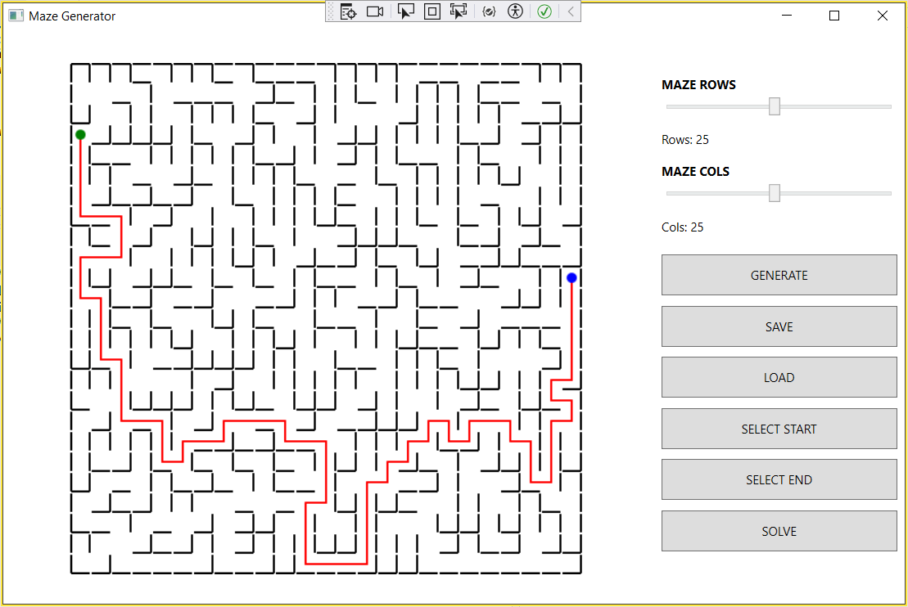

# Maze

Десктопное приложение для генерации, визуализации и решения идеальных лабиринтов с графическим интерфейсом на WPF.

## Мой вклад в проекте

В рамках групповой разработки я отвечала за:

- **Разработку графического интерфейса на WPF** — создание удобного и интуитивно понятного интерфейса для взаимодействия с лабиринтом
- **Реализацию алгоритма поиска решения (BFS)** — поиск кратчайшего пути между двумя точками с отрисовкой маршрута через центры ячеек
- **Визуализацию лабиринта** — динамическое отображение сгенерированных и загруженных лабиринтов в поле 500×500 пикселей
- **Интеграцию интерфейса с логикой** — связывание пользовательских действий (загрузка, генерация, построение пути) с backend-частью приложения

## Функциональность

- Загрузка лабиринта из файла в заданном формате
- Автоматическая генерация идеального лабиринта (алгоритм Эллера) (пока не раелизован, сделаю свою реализацию)
- Визуализация лабиринта с настраиваемой толщиной стен
- Поиск и отображение кратчайшего пути между двумя точками (BFS)
- Сохранение сгенерированного лабиринта в файл

## Технологии

- C# / .NET
- WPF (Windows Presentation Foundation)
- BFS (поиск в ширину)
- Алгоритм Эллера (пока не раелизован, сделаю свою реализацию)
- Makefile

